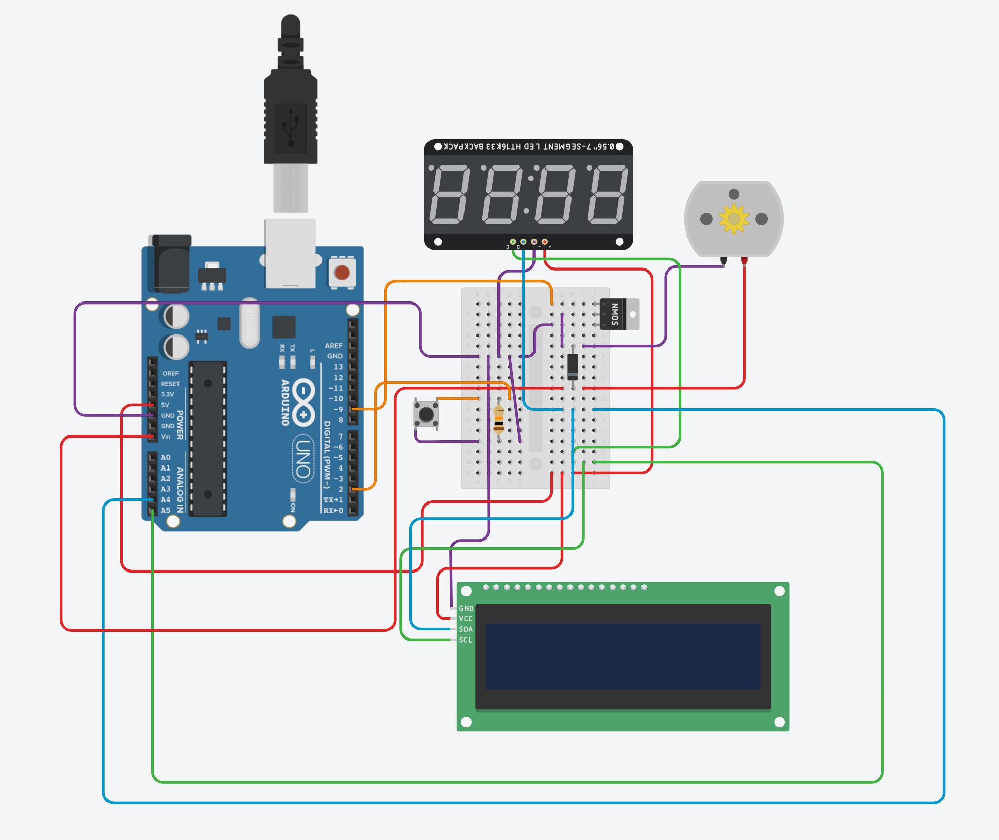
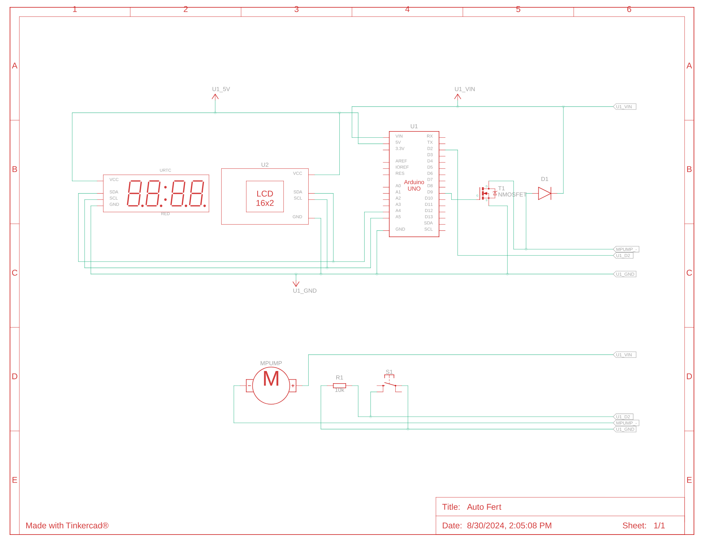
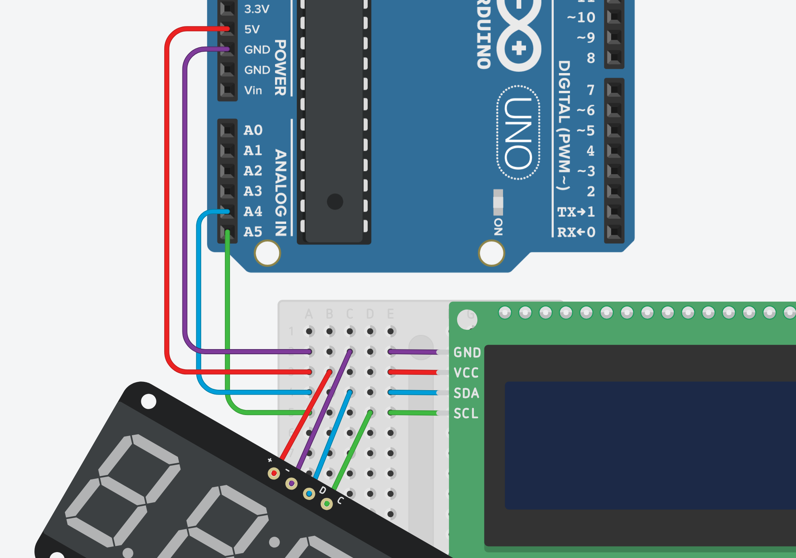
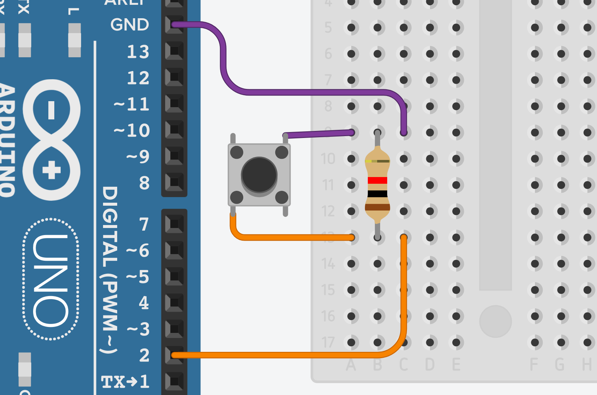
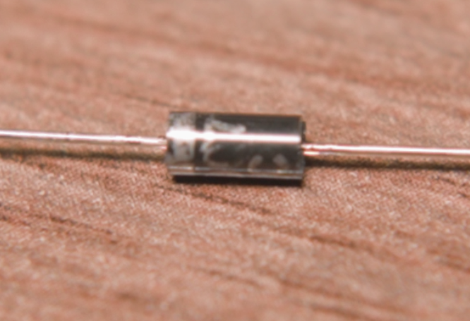
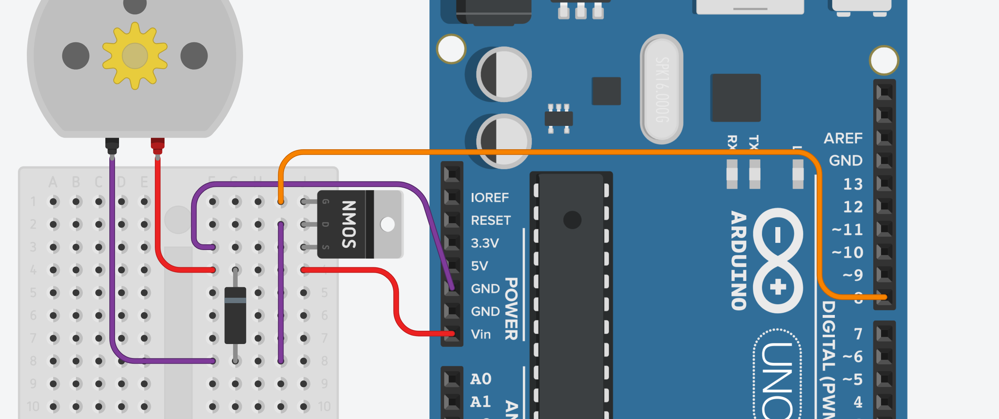

<!-- PROJECT LOGO -->

 

  

<h3 align="center">DIY Auto Fertilizer Unit</h3>

    An Arduino-based automated dosing system with a single pump and is designed to simplify the process of maintaining a healthy planted aquarium.
     
    <a href="https://youtu.be/4LGvgf0YLbo">Watch YouTube Video</a>
    ·
    <a href="https://github.com/Tropiscape/DIY-Auto-Fertilizer-Unit/issues/new?labels=bug&template=bug-report---.md">Report Bug</a>
  

<!-- TABLE OF CONTENTS -->

  
Table of Contents

  <ol>
    <li>
      <a href="#about-the-project">About The Project</a>
    </li>
    <li>
      <a href="#getting-started">Getting Started</a>
      <ul>
        <li><a href="#prerequisites">Prerequisites</a></li>
        <li><a href="#wiring">Wiring</a></li>
      </ul>
    </li>
    <li><a href="#contributing">Contributing</a></li>
    <li><a href="#license">License</a></li>
    <li><a href="#contact">Contact</a></li>
  </ol>

<!-- ABOUT THE PROJECT -->
## About The Project

  

There were times when I completely forgot to fertilizer my planted aquarium. More so, if I were to go on vacation, I would need to find someone I trust to dose that tank. So, why not have a machine do it instead?! This project is very simplified as it only utilizes a single pump. 

(<a href="#readme-top">back to top</a>)

<!-- GETTING STARTED -->
## Getting Started

### Prerequisites

- List of required hardware can be found [here](https://listium.com/@Tropiscape/113693/).

- [Arduino IDE](https://www.arduino.cc/en/software) or any other IDE's that can upload to an Arduino.

- ***RTClib***, ***Wire***, ***LiquidCrystal_I2C***, ***EEPROM***, ***avr/wdt***, and ***AceSorting*** Arduino Libraries.
  
  - In Arduino IDE: Tools → Manage Libraries → Search and Install required libraries.

<!-- Wiring -->
## Wiring

  

  

***Note***: *TinkerCAD does not have a component for RTCs. I used a Clock Display instead as both components are identical when it comes to wiring.*

Feel free to skip this part if you are familiar with wiring an Arduino. If you are new, please take the time to familiarize yourself with breadboards. A good tutorial can be found [here.](https://www.youtube.com/watch?v=W6mixXsn-Vc&t=14s&pp=ygUVaG93IGJyZWFkYm9hcmQgd29ya3Mg)

#### RTC + LCD Wiring

Wiring the RTC and LCD screen is very straight forward as long as you follow the Colour Legend. Both are virtually the same when it comes down to wiring.

-  `Power (VCC)` → `5V` 

-  `Ground (GND)` → `GND` 

-  `Serial Clock Line (SCL)` → `A5` 

-  `Serial Data Line (SDA)` → `A4`

<i>Example:</i>

  

#### Button Wiring

*If you have a 4 pin button, you will need to use the pins that are diagonal from each other.*

We will also need to use a 10kΩ Resistor for the button.

 `Ground (GND)` → `One end of the resistor` → `One pin on the button` → `GND`

 `Input/Output` → `Other end of the resistor` → `Digital Pin 2`

<i>Example:</i>

  

#### MOSFET + Pump Wiring

  
   
<i>
   <a href="https://oscarliang.com/how-to-use-mosfet-beginner-tutorial/">Source for Image</a> 
</i>

 

MOSFETs all have a Gate, Drain, and a Source pin. 

- **Gate**: The control pin that determines whether the MOSFET is on or off. Voltage applied here allows current to flow between the Drain and Source.

- **Drain**: The pin where the current enters the MOSFET when it is turned on.

- **Source**: The pin where the current exits the MOSFET, usually connected to ground or a negative voltage in typical setups.

However, we will need to add a Flyback Diode to protect the MOSFET from short-circuiting. *Please make sure that you have the correct orientation when installng the Flyback Diode.*

 `Grey/Marked End` → ***Positive***

 `Black/Non-Marked End` → ***Negative***

  

The wiring colour scheme is as follows:

 `Ground 1 (Source)` → `GND`

 `Ground 2 (From Pump)` →  `Black/Non-Marked End` → `Drain`

 `Input/Output` → `Digital Pin 2`

 `Power` →  `Grey/Marked End` → `Vin`

  

(<a href="#readme-top">back to top</a>)

<!-- CONTRIBUTING -->

## Contributing

Contributions are what make the open source community such an amazing place to learn, inspire, and create. Any contributions you make are **greatly appreciated**.

If you have a suggestion that would make this better, please fork the repo and create a pull request. You can also simply open an issue with the tag "enhancement". The same goes for any changes to the hardware and wiring.
Don't forget to give the project a star! Thanks again!

1. Fork the Project
2. Create your Feature Branch (`git checkout -b feature/AmazingFeature`)
   - Use the Hardware Branch for any hardware or wiring changes.
3. Commit your Changes (`git commit -m 'Add some AmazingFeature'`)
4. Push to the Branch (`git push origin feature/AmazingFeature`)
5. Open a Pull Request

(<a href="#readme-top">back to top</a>)

### Top contributors:

<!-- LICENSE -->

## License

Distributed under the GNU GPLv3 License. See `LICENSE.txt` for more information.

(<a href="#readme-top">back to top</a>)

<!-- CONTACT -->

## Contact

**YouTube:** [Tropiscape Aquatics](https://www.youtube.com/@tropiscapeaquatics) 

**Email:** TropiscapeAquatics@gmail.com

**Discord Server:** [Invite](https://discord.com/invite/NuVphNdNfC)

(<a href="#readme-top">back to top</a>)

<!-- MARKDOWN LINKS & IMAGES -->
